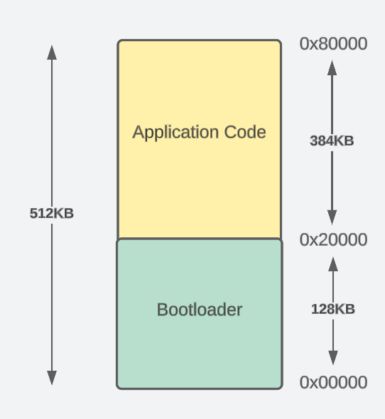
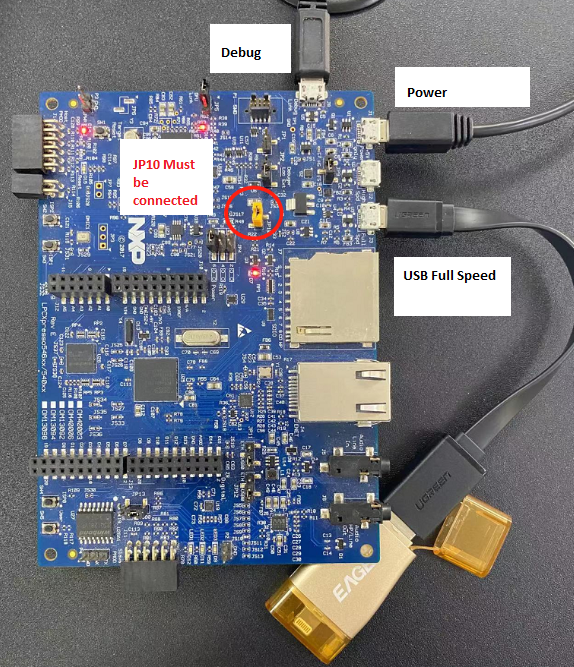

## NXP LPC-54608 USB Bootloader Project

Architecture 

Place your application binary in the pen drive under a filename "APP.BIN" in the root directory. Note: offset by 0x20000

You must be able to see the contents printed in Debug console in SWO

Notes:
1. BOOT_DETECT GPIO line : PIO_1_22 active low. 
2. Application Code Offset Address 0x20000
   
To Do:
1. Introduce no_init RAM to switch between App and Boot.
2. Remove GPIO dependency.
3. Read the App. if it has not changed, don't blindly overwrite.

